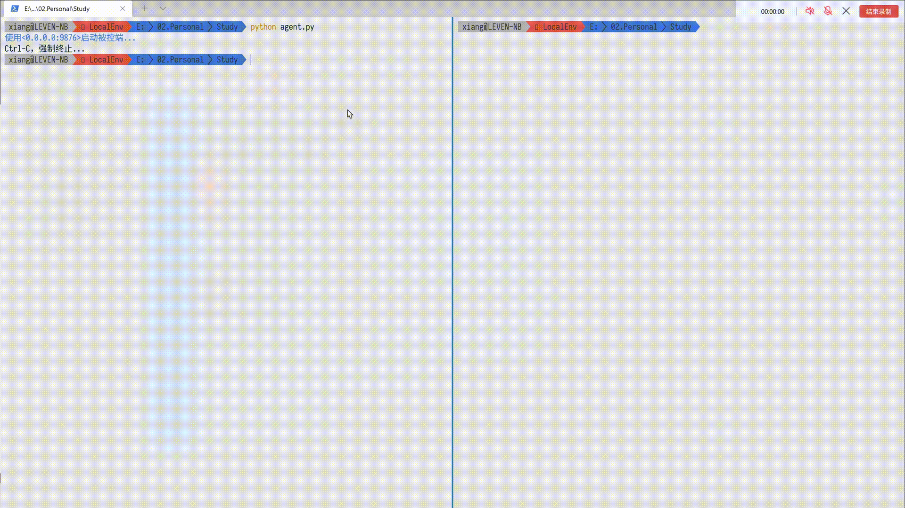
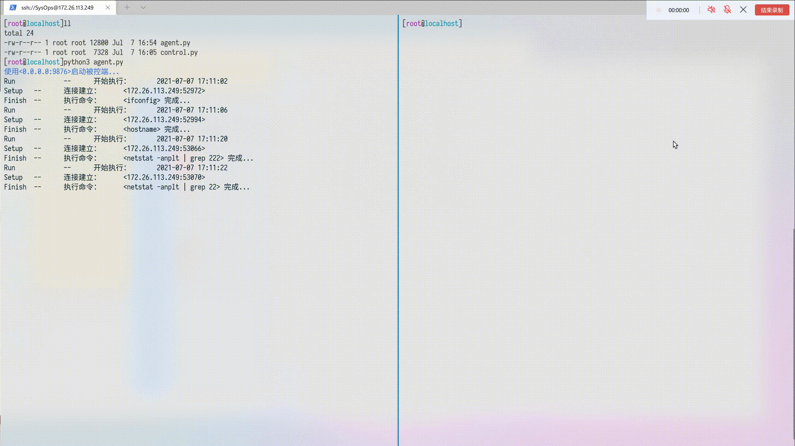

# 基于Socket的远程执行命令托管程序
> 总会有一些场景，不想使用繁杂的SSH或类似这种登录认证的方式来对被管理的机器、容器等等进行一些批量的下发命令的操作。
> 所以就写了这么一个小东西，可嵌入到自己的使用环境中，直接快速使用

## Help
```shell
# python agent.py -h

使用: python3 agent.py [options...]
参数:
    -i : 指定运行服务的IP，默认IP <0.0.0.0>
    -p : 指定运行服务的端口，默认端口 <9876>
    -h : 帮助信息
    python3 agent.py -i 172.16.123.10 -p 1234

# 
```
```shell
# python control.py -h

使用: python3 .\control.py [options...]
参数:
    -f : 读取主机列表文件，逐台执行命令。提示：文件中<主机一行一个>
    -i : 指定要连接主机IP，默认IP <127.0.0.1>
    -p : 指定要连接的主机端口，默认端口 <9876>
    -c : 要执行的命令
    -s : 不回显命令的执行结果
    -h : 帮助信息
    python3 .\control.py -i 172.16.123.10 -c "ifconfig"
   
# 
```

# 效果预览

### Windows



### Linux


### Linux -- 如果输入的命令是前台带交互的，可打断
